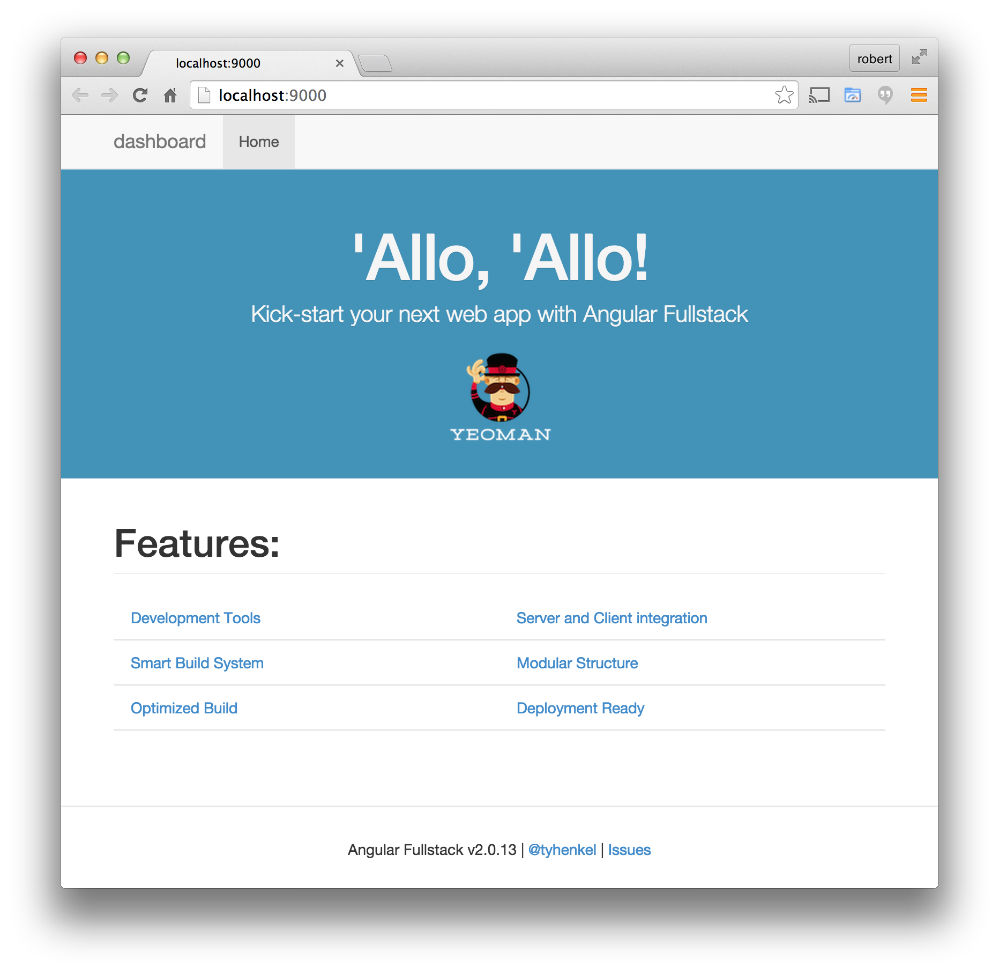

.. _create_new_project:

Creating a new project
==========

This part of the guide will walk you through the creation of an AngularJS
project from scratch.  We will use Grunt as a build tool, and Yeoman as
a scaffolding tool.

We will use Node.JS as our backend server, with the Stormpath Express SDK

Installing Node, Grunt, Bower and Yeoman
-----------------------

If you haven't installed Node.js on your system you can get it from https://nodejs.org

Then you need to install Grunt, a tool for helping you get things done w
with your project.  This can be installed as a global npm package::

    $ npm install -g grunt-cli

If you would like to learn more about Grunt, see the `Getting Started Guide`_

The next tool you need is Yeoman_, which is a skeleton/scaffolding tool.  This is also installed as a global NPM package::

    $ npm install -g yo

Finally we will isntall `Bower`_, a package manager for front-end applications
::

    $ npm install -g bower

.. _Bower: http://bower.io/
.. _Yeoman: http://yeoman.io/
.. _Getting Started Guide: http://gruntjs.com/getting-started

Create an Angular-fullstack project
------------------------------------

We are going to use the `Angular Fullstack`_ generator, which will create some boilerplate Angular code and Express.js server code for us.  Generators need to be installed globally as well::

    $ npm install -g generator-angular-fullstack

At this point you should create a directory for your project and go into it::

    $ mkdir my-angular-project && cd $_

Once there we use the generator to create the project.  We need to give our application a name (it does not have to be the same as the folder).  Since we are budilng a basic user dashboard for our API we will call it dashboard::

    $ yo angular-fullstack dashboard-app

The generator will ask you several questions, such as which templating engine to use.  We're sticking to vanilla HTML/CSS/JS for this guide, the only choice we are making is to the the 3rd-part `ui-router`_ instead of Angular's default.  Here are the choices that we made::

    # Client

    ? What would you like to write scripts with? JavaScript
    ? What would you like to write markup with? HTML
    ? What would you like to write stylesheets with? CSS
    ? What Angular router would you like to use? uiRouter
    ? Would you like to include Bootstrap? Yes
    ? Would you like to include UI Bootstrap? No

    # Server

    ? Would you like to use mongoDB with Mongoose for data modeling? No

Assuming everything installs OK you should now have the default project, ready to go.  Use this grunt command to start the development server and see the application::

    $ grunt serve

You should see an application that looks like this:

Now would be a good time to start using Git with your project, you can
stop the server by pressing `Ctrl+C` - then use these git commands::

    $ git init
    $ git add .
    $ git commit -m "Begin dasbhoard app project"

Install the Stormpath packages
--------------------------

We need to add two packages to this project, the `Stormpath Express SDK`_ and the `Stormpath Angular SDK`_.

Install them with NPM, using the save flag to add them to your package dependencies::

    $ npm install --save stormpath-sdk-express
    $ bower install --save stormpath-sdk-angularjs

We also want to make sure that we are using the latest version of Express, run
this command to get the latest::

    $ npm i express@latest --save

Create a Stormpath Account
--------------------------

Now that you're ready to integrate Stormpath, the first thing you'll want to use is
create a new Stormpath account by visiting https://api.stormpath.com/register

Create an API Key Pair
----------------------

Once you've created a new account, create a new API key pair by logging into
the `Stormpath Admin Console`_ and clicking the "Manage API Keys" button.  This will generate a new API key for you, and prompt you to download your keypair.

.. note::
    Please keep the API key pair file you just downloaded safe!  These two keys
    allow you to make Stormpath API requests, and should be properly protected,
    backed up, etc.

Create a Stormpath Application
------------------------------

Next, you'll want to create a new Stormpath Application.

Stormpath allows you to provision any number of "Applications".  An "Application" is just Stormpath's term for a project.

Let's say you want to build a few separate websites.  One site named
"dronewars.com", and another named "carswap.com".  In this case, you'd want to
create two separate Stormpath Applications, one named "dronewars" and another
named "carswap".  Each Stormpath Application should represent a real life
application of some sort.

The general rule is that you should create one Application per website (or
project).  Since we're just getting set up, you'll want to create a single
Application.

To do this, click the "Applications" tab in the Stormpath dashboard, then click
"Register an Application" and follow the on-screen instructions.

.. note::
    Use the default options when creating an Application, this way you'll be
    able to create users in your new Application without issue.

Configure your environment variables
------------------------------------

Now that you have your API keys and app href, you want to modify the file found in ``server/config/local.env.js``.  Add these properties to the export block, and fill in your values::

    module.exports = {
      DOMAIN: 'http://localhost:9000',
      SESSION_SECRET: "dashboard-secret",
      // Control debug level for modules using visionmedia/debug
      DEBUG: '',
      STORMPATH_API_KEY_ID: 'YOUR_KEY_ID',
      STORMPATH_API_KEY_SECRET: 'YOUR_KEY_SECRET',
      STORMPATH_APP_HREF: 'YOUR_APP_HREF'
    };

Grunt will automatically export these values to the environment, and the Stormpath SDK will pick them up automatically.

.. _Stormpath Admin Console: https://api.stormpath.com
.. _Stormpath Angular SDK: https://github.com/stormpath/stormpath-sdk-angularjs
.. _Stormpath Express SDK: https://github.com/stormpath/stormpath-sdk-express