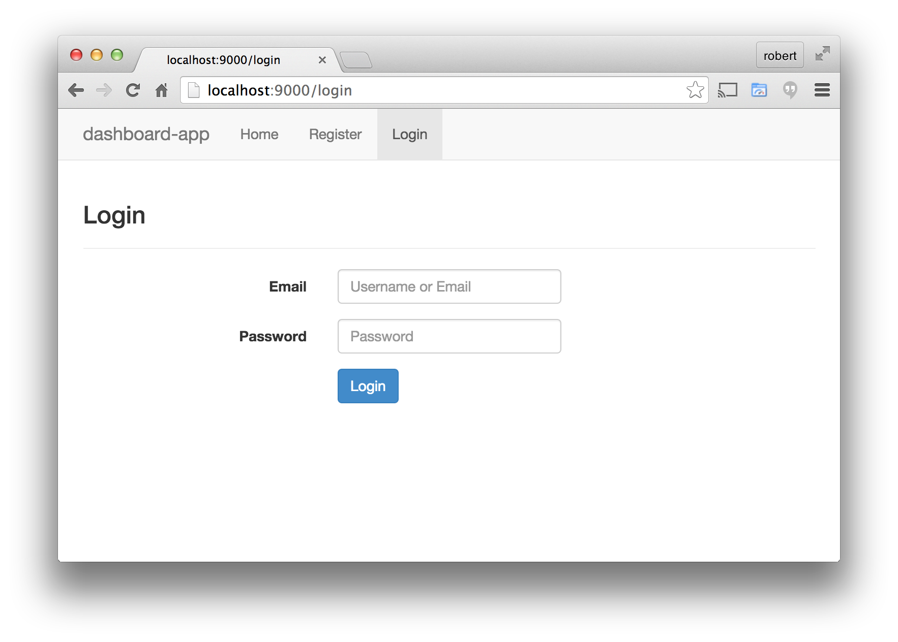

.. _login:

Create the Login form
============================

Login forms are pretty straightforward, why re-invent the wheel?
The Stormpath Angular SDK includes a default login form that you can
simply insert into your application.  In the next release of this guide
we will show you how to add password reset functions to this form, see
:ref:`coming_soon`

Generate the /login route
--------------------------------

Like we did with the Registration page, we will use the generator
to create the login route.

Stop the server and run this command in your project folder, pressing
enter to choose all the default options when it asks::

    $ yo angular-fullstack:route login

Use the Login Form Directive
--------------------------------

Open the file ``client/app/login/login.html`` and then replace
it's contents with this::

    

    

      

        

          <h3>Login</h3>
          

        

      

      

    

This is a small bit of HTML markup which does the following:

* Includes the common menu bar for the application (we customized it in the last section)
* Sets up some Bootstrap classes so that the page flows nicely
* Inserts the default login form, via the `spLoginForm <https://docs.stormpath.com/angularjs/sdk/#/api/stormpath.spLoginForm:sp-login-form>`_ directive

Save that file and the browser should auto reload, you should now
see the login route like this:

If you want to further customize the look and behaviour of the form,
please see the API documentation of for
`spLoginForm <https://docs.stormpath.com/angularjs/sdk/#/api/stormpath.spLoginForm:sp-login-form>`_ directive.
The most useful feature is the ability to specify your own template.

Try it, log back in!
--------------------------------

Submit the username and password that you created when you registered,
you should be redirected back to the main view and you should see the
logged-in changes to the menu bar.