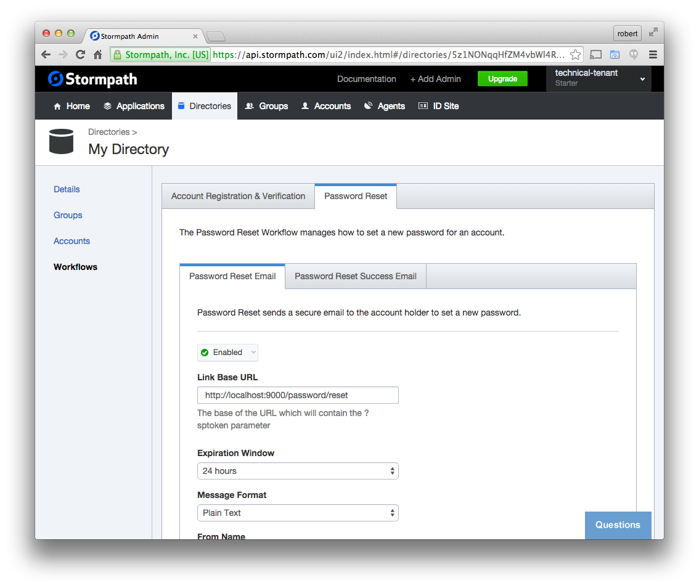

.. _password_reset:

Password Reset Flow
============================

Stormpath has your back when it comes to password reset!  We have
a complete, secure solution that allows your users to request a password
reset by email.  We send the user a link with a verification token, when
they click on this link they arrive back at your site.  You then validate
that this token came from us, and allow the user to set a new password.
We do all the heavy lifting for you!

We are going to create two separate UI routes for this flow:

* ``/password/requestReset`` will serve a form which alllows the user to ask for a new email.
* ``/password/reset`` will be the page they land on when they click on the link in their email.

Generate the routes
--------------------------------

Using the generator command, create a route named ``passwordResetRequest`` but make sure
that you set the URL to ``/password/requestReset`` when prompted.  We will use this
route to render a form which asks them for their email address::

    $ yo angular-fullstack:route passwordResetRequest
    ? Where would you like to create this route? client/app/
    ? What will the url of your route be? /password/requestReset
       create client/app/passwordResetRequest/passwordResetRequest.js
       create client/app/passwordResetRequest/passwordResetRequest.controller.js
       create client/app/passwordResetRequest/passwordResetRequest.controller.spec.js
       create client/app/passwordResetRequest/passwordResetRequest.css
       create client/app/passwordResetRequest/passwordResetRequest.html

Then we want to make a form which allows them to set a new password, after we verify
that they have arrived with a valid reset token.  We will name this view ``passwordReset``
and give it a URL of ``/password/reset`` - make sure to set this when prompted::

    $ yo angular-fullstack:route passwordReset
    ? Where would you like to create this route? client/app/
    ? What will the url of your route be? /password/reset
       create client/app/passwordReset/passwordReset.js
       create client/app/passwordReset/passwordReset.controller.js
       create client/app/passwordReset/passwordReset.controller.spec.js
       create client/app/passwordReset/passwordReset.css
       create client/app/passwordReset/passwordReset.html

Add the sptoken parameter
--------------------------------

When the user clicks on the link in their email, they will be sent to your
application with a url parameter called ``sptoken`` - we need to let the UI
router know about this.  Open the file
``client/app/passwordReset/passwordReset.js`` and modify the ``url``
string to include this parameter:
::
    url: '/password/reset?sptoken',

Use the password reset directives
--------------------------------

We want to modify the two views that we created in the last steps.

Open `client/app/passwordReset/passwordReset.html` and replace it's contents with this:

    

    

      

        

          <h3>Reset Your Password</h3>
          

        

      

      

    

Next find `client/app/passwordResetRequest/passwordResetRequest.html` and replace it's contents with this:

    

    

      

        

          <h3>Request Password Reset</h3>
          

        

      

      

    

Configure the Directory
------------------------------------

In order to use the password reset feature you will need to enable it
on the Directory that this account will be created in.  Login to the
`Stormpath Admin Console`_ and find the Directories tab.  You will see the
Directory that was automatically created for the Application.  Click into it,
find the Workflows tab, then the Password Reset tab.

You need to enable the **Password Reset Email** and modify the **Link Base URL**
to point to your application.  At the moment that URL will be::

    http://localhost:9000/password/reset

Don't forget to press save!

Here is what that screen looks like:

Try it, reset your password!
--------------------------------

This form should be fully functional now!  Visit the Login page and you
will see a link to the Forgot Password flow.

.. _Stormpath Email Verification: http://docs.stormpath.com/rest/product-guide/#verify-an-email-address

.. _Stormpath Admin Console: https://api.stormpath.com/login