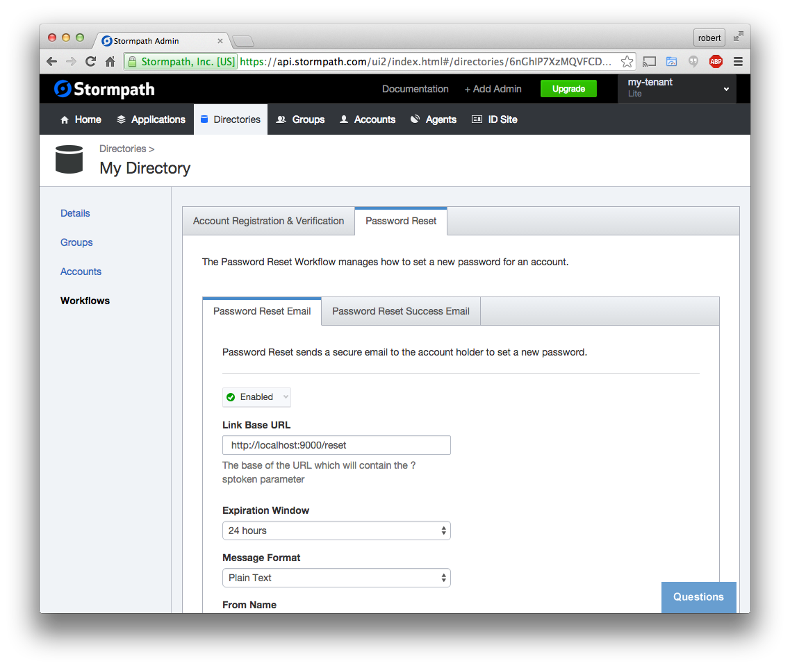

.. _password_reset:

Password Reset Flow
============================

Stormpath provides a secure solution that allows your users to request a password
reset token by email.  We send the user a link with a verification token; when
they click on this link, they arrive back at your site.  You then validate
that this token came from Stormpath and ask the user to set a new password.

This Angular SDK provides forms that faciliate this process for you.

We need two separate UI routes for this flow:

* ``/forgot`` will serve a form that asks the user for their email address.  When
  this form is submited we will send the email with a password reset link.
* ``/reset`` will be the page they land on when they click on the link in their email.

Generate the Routes
--------------------------------

Using the generator command, create a routes for ``forgot`` and ``reset``:

.. code-block:: bash

    $ yo angular-fullstack:route forgot

.. code-block:: bash

    ? Where would you like to create this route? client/app/
    ? What will the url of your route be? /forgot

.. code-block:: bash

    $ yo angular-fullstack:route reset

.. code-block:: bash

    ? Where would you like to create this route? client/app/
    ? What will the url of your route be? /reset

Add the sptoken Parameter
--------------------------------

When the user clicks on the link in their email, they will be sent to your
application with a url parameter called ``sptoken`` - we need to let the UI
router know about this.  Open the file ``client/app/reset/reset.js`` and modify
the ``url`` string to include this parameter::

    url: '/reset?sptoken',

Use the Password Reset Directives
--------------------------------

We want to modify the two views that we created in the last steps.

Open ``client/app/forgot/forgot.html`` and replace its contents with this:

.. code-block:: html

    

    

      

        

          <h3>Forgot Password</h3>
          

        

      

      

    

Next, open ``client/app/reset/reset.html`` and replace its contents with this:

.. code-block:: html

    

    

      

        

          <h3>Reset Your Password</h3>
          

        

      

      

    

Configure the Directory
------------------------------------

In order to use the password reset feature, you will need to enable it
on the Directory that this account will be created in.  Login to the
`Stormpath Admin Console`_ and find the Directories tab.  You will see the
Directory that was automatically created for the Application.  Click into it,
find the Workflows tab, then the Password Reset tab.

You need to enable the **Password Reset Email** and modify the **Link Base URL**
to point to your application.  At the moment that URL will be:

.. code-block:: bash

    http://localhost:9000/reset

Don't forget to press save!

Here is what that screen looks like:

Try It, Reset your Password!
--------------------------------

This form should be fully functional now!  Visit the Login page and you
will see a link to the Forgot Password flow.

.. _Stormpath Email Verification: http://docs.stormpath.com/rest/product-guide/#verify-an-email-address

.. _Stormpath Admin Console: https://api.stormpath.com/login