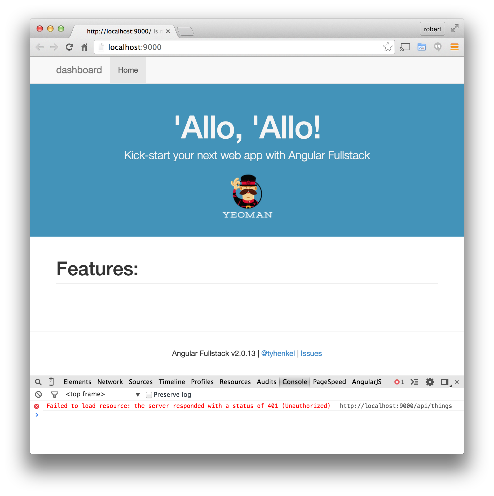

.. _protect_api:

Configure the Server
====================

In the previous section, :ref:`create_new_project`, we created a simple
Express.js and installed the `Stormpath Express SDK`_.  We are going to use that
SDK to secure the API endpoints in the Express server.

Setting Environment Variables
------------------------------------

The `Stormpath Express SDK`_ needs the API Key and Application information that
we collected in the section :ref:`create_tenant`.  We will provide this
information to the SDK by exporting it to the environment.

The ``Gruntfile`` of this project has a task that will automatically export the
properties that are added to ``server/config/local.env.js``.  Open that file,
add these properties to the export block, and fill in your values::

    module.exports = {
      DOMAIN: 'http://localhost:9000',
      SESSION_SECRET: "dashboard-secret",
      // Control debug level for modules using visionmedia/debug
      DEBUG: '',
      STORMPATH_API_KEY_ID: 'YOUR_KEY_ID',
      STORMPATH_API_KEY_SECRET: 'YOUR_KEY_SECRET',
      STORMPATH_APP_HREF: 'YOUR_APP_HREF'
    };

Grunt will automatically export these values to the environment, and the
`Stormpath Express SDK`_ will pick them up automatically.

.. note::

  This file will be hidden from Git and never checked into your repo, this
  is for security purposes.  When you deploy your application to production
  you should use the features of your deployment system to export these
  variables to your environment.  For example if you are using Herkou, you
  would use the `Configuration and Config Vars`_ feature.

.. note::

  You can manually export the values to the environment by using the ``export``
  or ``set`` commands in your terminal.

  **Unix/Linux/Mac**::

    export STORMPATH_API_KEY_ID=YOUR_STORMPATH_API_KEY_ID
    export STORMPATH_API_KEY_SECRET=YOUR_STORMPATH_API_KEY_SECRET
    export STORMPATH_APP_HREF=YOUR_STORMPATH_APP_HREF

  **Windows**::

    set STORMPATH_API_KEY_ID=YOUR_STORMPATH_API_KEY_ID
    set STORMPATH_API_KEY_SECRET=YOUR_STORMPATH_API_KEY_SECRET
    set STORMPATH_APP_HREF=YOUR_STORMPATH_APP_HREF

Add the Stormpath Middleware
---------------------------

Find the file ``server/routes.js``.

This file is attaching some routes to the Express application that is setup in
``server/app.js``.

We want to initialize the Stormpath middleware and add it before our API
declaration, so that the API will be automatically protected.

First things first, you need to require the SDK - place this at the top of the
file::

    var stormpathExpressSdk = require('stormpath-sdk-express');

Then you want to create an instance of the Stormpath middleware.  You can pass
options, but in our case, we are just going to make a simple call and use all
the default options.  Add this line before the ``module.exports`` statement::

    var spMiddleware = stormpathExpressSdk.createMiddleware();

Then inside the module.exports, before any other `app` statements::

    spMiddleware.attachDefaults(app);

This will attach the following route handlers to your Express app:

* ``POST /oauth/token`` (accepts the login form POST, returns an access token)
* ``POST /api/users`` (for creating new users)
* ``GET /api/users/current`` (for getting info about the current user, as permitted by the access token)
* ``GET /logout`` (for ending the current session, the access token is destroyed)

The last thing we need to do is secure the things endpoint.  Modify that line
to use the authenticate middleware::

    app.use('/api/things', spMiddleware.authenticate, require('./api/thing'));

Reload the App
---------------

Restart the server by running ``grunt serve`` again.  You should now see that
the features are no longer listed - this is because the endpoint fails to load
with a ``401 Unauthorized`` - you can see this by looking inside the web console
in your browser:

Our API is now protected from unauthorized, anonymous access.  In the next two
sections, we will show you how to create a registration form and a login form.
At that point, you will be able to login and have access to the API.

.. _Configuration and Config Vars: https://devcenter.heroku.com/articles/config-vars
.. _Stormpath Express SDK: https://github.com/stormpath/stormpath-sdk-express