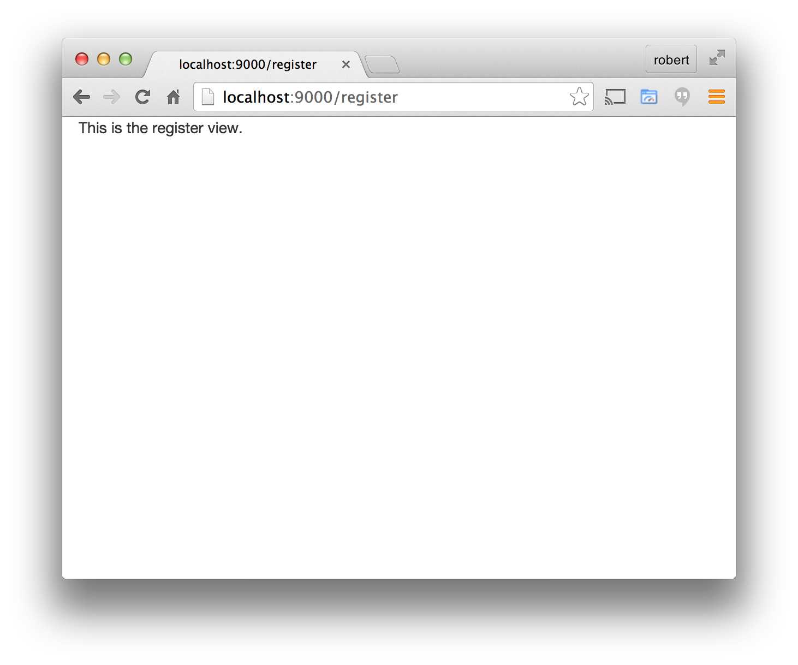
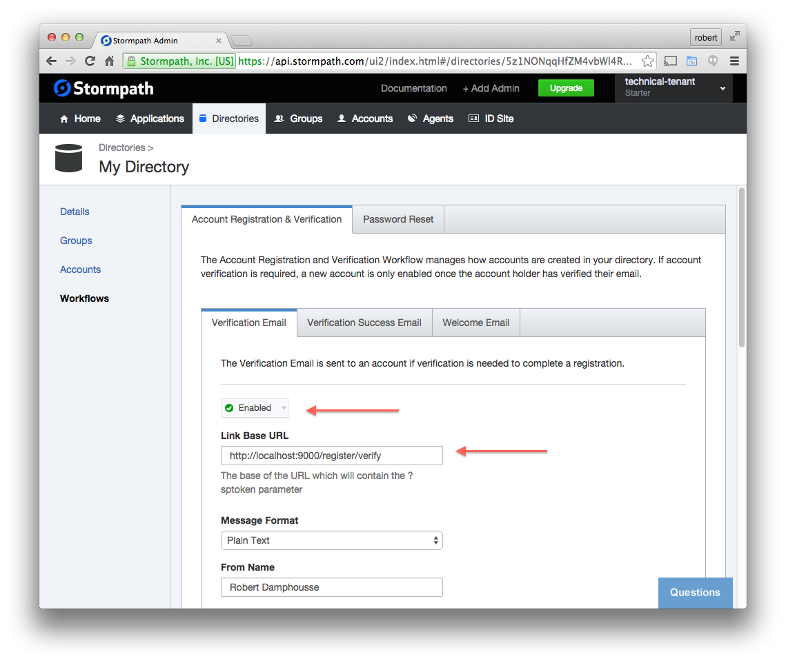

.. _register:

Create the Registration Form
===================

We want our users to sign up for our service, so we need to provide a
registration form.  The `Stormpath Angular SDK`_ provides a pre-built
registration form that can be inserted with an Angular directive.  When a user
submits this form, it will create a new account for them in the Stormpath
Directory that is associated with the Stormpath Application that you created in
the :ref:`create_tenant` section.

Generate the /register Route
--------------------------------

Stop the server and run this command in your project folder:

.. code-block:: bash

    $ yo angular-fullstack:route register

Press enter to accept the defaults options:

.. code-block:: bash

    ? Where would you like to create this route? client/app/
    ? What will the url of your route be? /register

The following files will be created:

.. code-block:: bash

    create client/app/register/register.js
    create client/app/register/register.controller.js
    create client/app/register/register.controller.spec.js
    create client/app/register/register.css
    create client/app/register/register.html

Start the server and then click on the Register link in the menu bar in your
browser. You will see that the default view was created:

Add the Registration Form Directive
-----------------------------------

Open the file ``client/app/register/register.html`` and then replace
its contents with this:

.. code-block:: html

    

    

      

        

          <h3>Registration</h3>
          

        

      

      

    

This HTML markup does the following:

* Includes the common menu bar for the application.
* Sets up some `Bootstrap`_ classes so that the page flows nicely.
* Inserts the default registration form via the `spRegistrationForm`_ directive.
* Declares (on the directive) that we want to send the user to the main page after they register.

Save that file, and the browser should auto-reload. You should now
see the registration view like this:

.. image:: _static/registration_form.png

If you want to further customize the look and behavior of the form,
please see the API documentation for the
`spRegistrationForm`_ directive.
The most useful feature is the ability to specify your own template.

Generate the /register/verify Route
--------------------------------

The `Stormpath Email Verification`_ feature will allow you to confirm a user's
identity by sending them a link that they must click on.
We handle all the email and links for you!  (If you don't want to use this
feature, you can skip this section.)

However, we must decide where the user should go when they click on that
link in their email.  We will implement a default view for this in our application
and configure the Stormpath Directory accordingly.

The first thing is to generate another route.  In this situation, we will
call the controller ``emailVerification``, but use the URL of ``/register/verify``:

.. code-block:: bash

  $ yo angular-fullstack:route emailVerification
  ? Where would you like to create this route? client/app/
  ? What will the url of your route be? /register/verify
     create client/app/emailVerification/emailVerification.js
     create client/app/emailVerification/emailVerification.controller.js
     create client/app/emailVerification/emailVerification.controller.spec.js
     create client/app/emailVerification/emailVerification.css

Add the sptoken Parameter
--------------------------------

When the user clicks on the link in their email, they will be sent to your
application with a url parameter called ``sptoken`` - we need to let the UI
router know about this.  Open the file
``client/app/emailVerification/emailVerification.js`` and modify the ``url``
string to include this parameter:
:

.. code-block:: js

    url: '/register/verify?sptoken',

Use the Email Verification Directive
------------------------------------

We have a pre-built view that shows the necessary informational
messages when someone is trying to complete the email verification process.
It will:

* Show a success message and prompt them to login.
* Allow them to request another email if the link has expired.

Open the file ``client/app/emailVerification/emailVerification.html`` and
replace its contents with the following:

.. code-block:: html

    

    

      

        

          <h3>Verify Your Account</h3>
          

        

      

      

    

Configure the Directory
------------------------------------

In order to use the email verification feature, you will need to enable it
on the Directory that this account will be created in.  Login to the
`Stormpath Admin Console`_ and find the Directories tab.  You will see the
Directory that was automatically created for the Application.  Click into it,
find the Workflows tab, and then enable the email verification workflow.

You should also modify the **Link Base URL** to point
to your application.  At the moment, that URL will be:

.. code-block:: html

    http://localhost:9000/register/verify

Don't forget to press save!

Here is what that screen looks like:

Try It, Register for an Account!
--------------------------------

That's it, really!  Give the form a try.  Once you register for an
account, you will be automatically redirected back to the main page.
You will also be logged-in automatically, and you will start seeing
the list of things again -- remember how we locked it down?  Now that
you are authenticated, you are allowed to access that part of the API
again.

Customizing the Form
----------------------

Do you need to customize the form?  This can be done by supplying
your own template and adding or removing the appropriate fields.

For example, create a new file in ``client/app/register/`` and call it
``my-register.html``.  Copy the contents from our existing ``register.html``
into it.  Then add the following markup to it in a place that you like:

.. code-block:: html

  

    <label for="favColor" class="col-xs-12 col-sm-4 control-label">Favorite Color</label>
    

      <input type="text" class="form-control" id="favColor" ng-model="formModel.customData.favColor" ng-disabled="creating">
    

  

Now, modify your registration form directive and tell it to use this custom template:

.. code-block:: html

  

Your registration form should have a new field for entering your favorite color!  This information
will go into the ``customData`` object on the Account object.

.. note::
  You need to ensure that your server-side framework is decoding complex form
  objects in POST bodies.  If you are using the common ``body-parser`` library, you can
  enable that with the ``extended`` option::

    app.use(bodyParser.urlencoded({ extended: true }));

For more information about the registration form, see the  `spRegistrationForm`_ documentation.

.. _Bootstrap: http://getbootstrap.com

.. _Stormpath Angular SDK: https://github.com/stormpath/stormpath-sdk-angularjs

.. _spRegistrationForm: https://docs.stormpath.com/angularjs/sdk/#/api/stormpath.spRegistrationForm:spRegistrationForm

.. _Stormpath Email Verification: http://docs.stormpath.com/rest/product-guide/#verify-an-email-address

.. _Stormpath Admin Console: https://api.stormpath.com/login