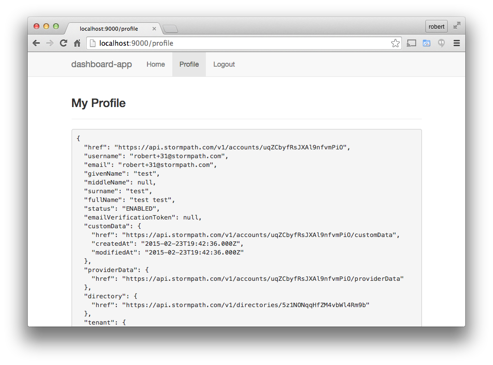

.. _user_dashboard:

Creating a User Profile View
=========================

Most user-centric application have a Profile view, where the user can view and
edit their basic profile information.  In this section we will show you how to
make a *very* simple display of the user's information.  In the next releasae of
this guide we will show you how to update the user's information, see :ref:`coming_soon`

Generate the /profile route
-----------------

Alright, one more time!  We're going to use the generator to scaffold the files for us::

    $ yo angular-fullstack:route profile

Force authentication
---------------------

The user must be logged in if they wan't to see their profile,
otherwise there is nothing to show!  We want to prevent users
from accessing this page if they are not logged in.  We do
that by defining the
`SpStateConfig <https://docs.stormpath.com/angularjs/sdk/#/api/stormpath.SpStateConfig:SpStateConfig>`_
on the UI state for this route.

Open the file ``client/app/profile/profile.js`` and modify the
state configuration to include the Stormpath state configuration::

    .state('profile', {
      url: '/profile',
      templateUrl: 'app/profile/profile.html',
      controller: 'ProfileCtrl',
      sp: {
        authenticate: true
      }
    });

Create the view
------------------

Because we have declared ``authenticate: true`` for this state, we
are guranteed that the user will always be logged in by the time that
this view loads (if the user is not logged in, they are redirected
to the login page - and then back here).

With that assurance we can code our template without any complex
switches.
The Stormpath module will automatically assign the current user
object to ``user`` on the Root Scope, so it will always be available
in your templates.

We're gonna keep this super simple and merely render user's object as a JSON
structure.  Obviously you'll be doing more than this when your application goes
live :)

Open the file ``client/app/profile/profile.html`` and then replace
it's contents with this::

    

    

      

        

          <h3>My Profile</h3>
          

        

      

      

        

          <pre ng-bind="user | json"></pre>
        

      

    

Just like the other pages, we've included our common menu and setup
some basic Bootstrap classes.  The ``<pre>`` block will leverage
Angular's built-in ``json`` filter to show the user object.

Try it out, see your profile!
-----------------------------

Go back to your browser, make sure your logged in and then go to the
Profile link.  You should now see your user data:

